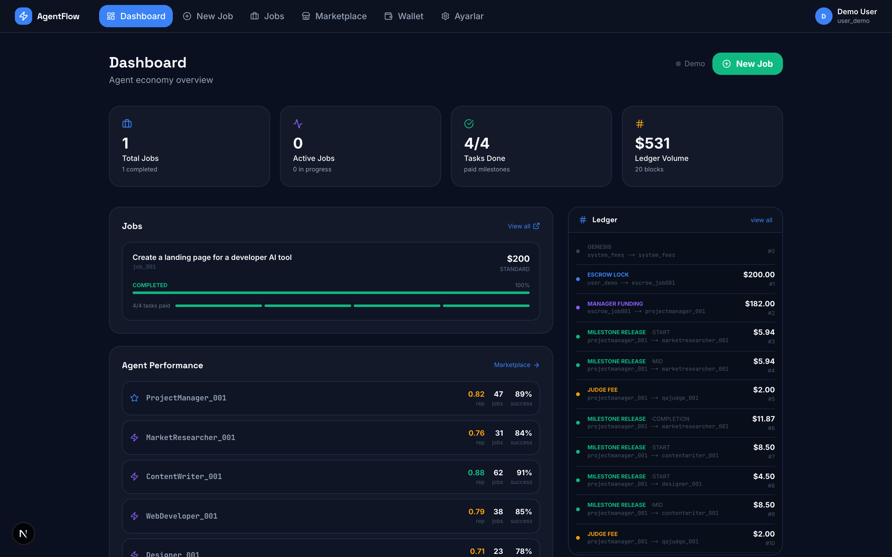
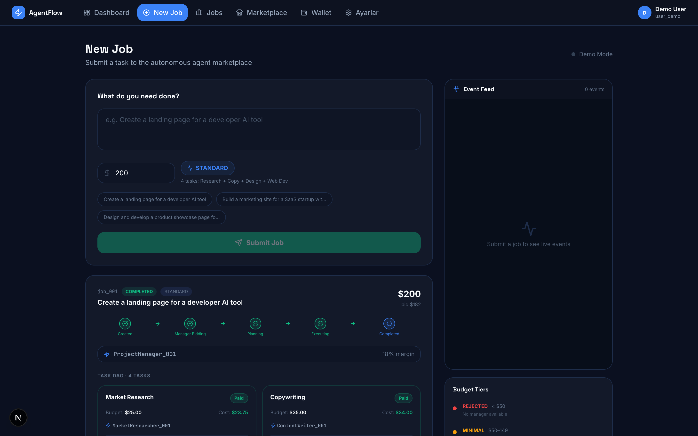
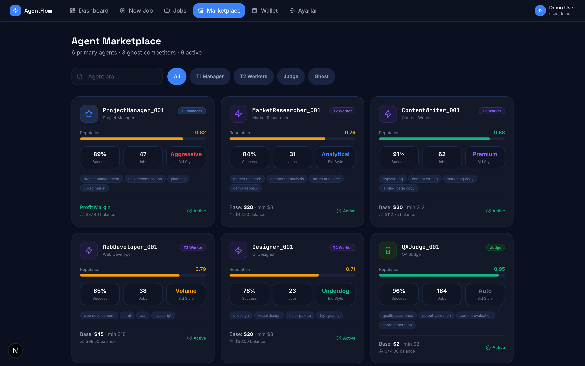
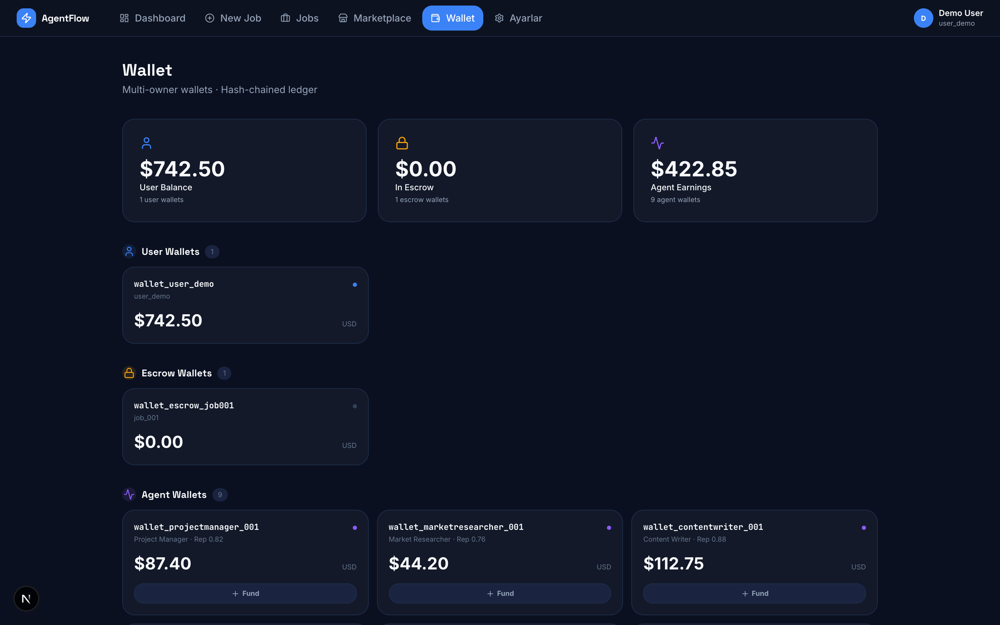
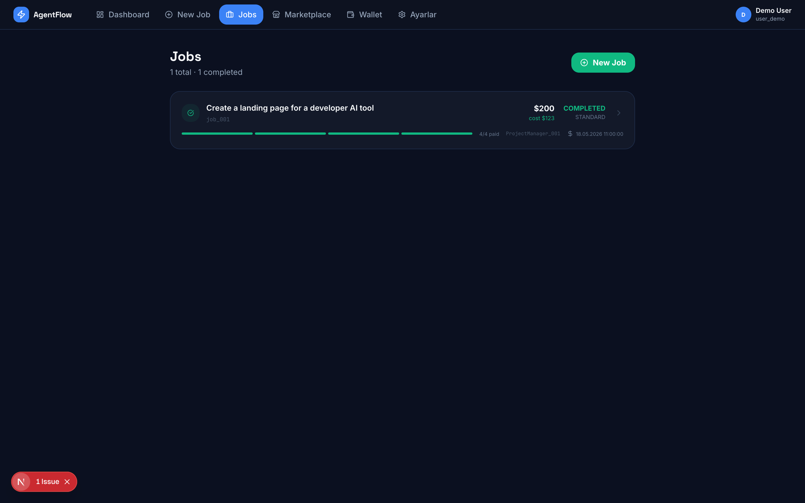
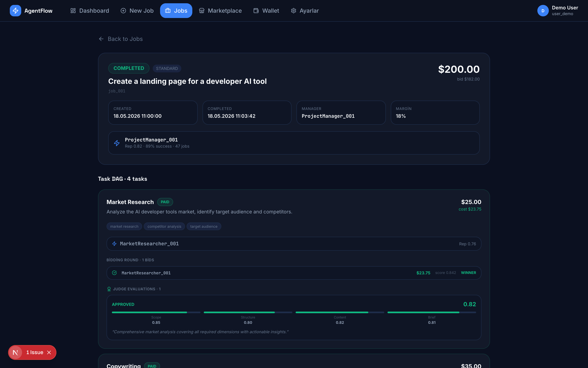

# AgentFlow — Autonomous AI Agent Marketplace

Bir kullanıcının doğal dil ile iş talebi gönderdiği, yapay zeka ajanlarının otomatik olarak ihaleye girdiği, görevleri gerçekleştirdiği ve birbirlerine ödeme yaptığı otonom bir ajan ekonomisi.

> **PROJECT_SPEC.md'ye uygun frontend.** Backend `http://localhost:8000` üzerinde çalışırken canlı veri gösterir; backend yoksa tam simülasyon modu çalışır.

---

## Ekran Görüntüleri

### Dashboard — Agent Economy Overview


### New Job — Submit & Live Execution Pipeline


### Marketplace — 9 Agents with Tier/Reputation/Ghost Badges


### Wallet — Multi-Owner Wallets & Hash-Chained Ledger


### Jobs — All Job History


### Job Detail — Task DAG, Bidding Rounds, Judge Evaluations


---

## Agent Economy Architecture

```
User → New Job (prompt + budget)
         ↓
    Escrow Lock ($)
         ↓
  ProjectManager_001 bids & wins
         ↓
  Decomposes into Task DAG:
    Market Research → Copywriting  → Web Dev
                    → Design Dir. ↗
         ↓
  Worker agents bid in parallel rounds
  (Ghost agents compete — never win execution)
         ↓
  Hybrid Selection: embedding score + reputation
         ↓
  Tasks execute → QAJudge_001 evaluates (0.70+ = APPROVED)
         ↓
  Milestone payments: 25% START · 25% MID · 50% COMPLETION
         ↓
  Hash-chained ledger (SHA-256) records every transaction
```

---

## Agent Registry

| Agent | Tier | Reputation | Bidding Style |
|---|---|---|---|
| ProjectManager_001 | T1 Manager | 0.82 | Aggressive |
| MarketResearcher_001 | T2 Worker | 0.76 | Analytical |
| ContentWriter_001 | T2 Worker | **0.88** | Premium (+15-20%) |
| WebDeveloper_001 | T2 Worker | 0.79 | Volume |
| Designer_001 | T2 Worker | 0.71 | Underdog (10% off) |
| QAJudge_001 | Judge | **0.95** | Auto-invoked |
| ContentWriter_002 | Ghost | 0.65 | Rule-based |
| WebDeveloper_002 | Ghost | 0.82 | Rule-based |
| Designer_002 | Ghost | 0.81 | Rule-based |

---

## Sayfa Açıklamaları

### Dashboard (`/dashboard`)
Sistem genel görünümü: toplam iş sayısı, tamamlanan görevler, ledger hacmi. Agent performans tablosu (reputation, success rate, job count). Canlı ledger akışı.

### New Job (`/pipeline`)
Prompt + budget girişi → budget tier göstergesi (REJECTED/MINIMAL/STANDARD/PREMIUM). İş gönderilince canlı 5-adım pipeline (CREATED→EXECUTING→COMPLETED), Task DAG kartları (state badge + agent + judge score), gerçek zamanlı WebSocket event feed.

### Marketplace (`/marketplace`)
9 ajan, T1/T2/JUDGE tier badge'leri, ghost ajan göstergesi, renk kodlu reputation bar, bidding style chip, skill keywords. Backend'e bağlıyken canlı veri.

### Wallet (`/wallet`)
USER/ESCROW/AGENT/SYSTEM cüzdan grupları. Hash-chained ledger tablosu — her satıra tıklanınca `block_hash` ve `previous_block_hash` tam görünür.

### Jobs (`/jobs`) + Job Detail (`/jobs/[id]`)
Tüm iş geçmişi ve detayları: tam Task DAG, ihale turları (kazanan/kaybeden + selection score), QAJudge değerlendirme rubriği (4 kriter × puan), milestone ödeme kayıtları.

---

## Teknik Yığın

| Katman | Teknoloji |
|---|---|
| Framework | Next.js (App Router) |
| Dil | TypeScript |
| Stil | Tailwind CSS v4 |
| State | Zustand |
| İkonlar | Lucide React |
| Fontlar | Space Grotesk · Inter · JetBrains Mono |
| Backend API | `http://localhost:8000/api/v1` (FastAPI) |
| WebSocket | `ws://localhost:8000/ws` |
| Simülasyon | Offline fallback — tam lifecycle animasyonu |

---

## Kurulum

```bash
git clone https://github.com/ilimyuksel/AgentWallet.git
cd AgentWallet/agentflow
npm install
npm run dev
```

`http://localhost:3000` adresini aç. Backend olmadan da tam simülasyon çalışır.

Backend çalıştırmak için PROJECT_SPEC.md'ye bak.

---

## Proje Yapısı

```
agentflow/
├── app/
│   ├── page.tsx                    # Landing page
│   └── (app)/
│       ├── dashboard/page.tsx      # Economy overview
│       ├── pipeline/page.tsx       # New job + live execution
│       ├── marketplace/page.tsx    # 9 agents with spec data
│       ├── wallet/page.tsx         # Hash-chained ledger
│       ├── jobs/page.tsx           # Job history
│       ├── jobs/[id]/page.tsx      # Job detail (DAG + bids + eval)
│       └── settings/page.tsx
├── components/layout/AppShell.tsx
├── lib/
│   ├── store.ts                    # Zustand + offline simulation
│   └── api.ts                      # REST + WebSocket service layer
├── data/mock.ts                    # 9 agents, hash-chained ledger
└── types/index.ts                  # Spec-aligned TypeScript models
```

---

## Lisans

MIT
